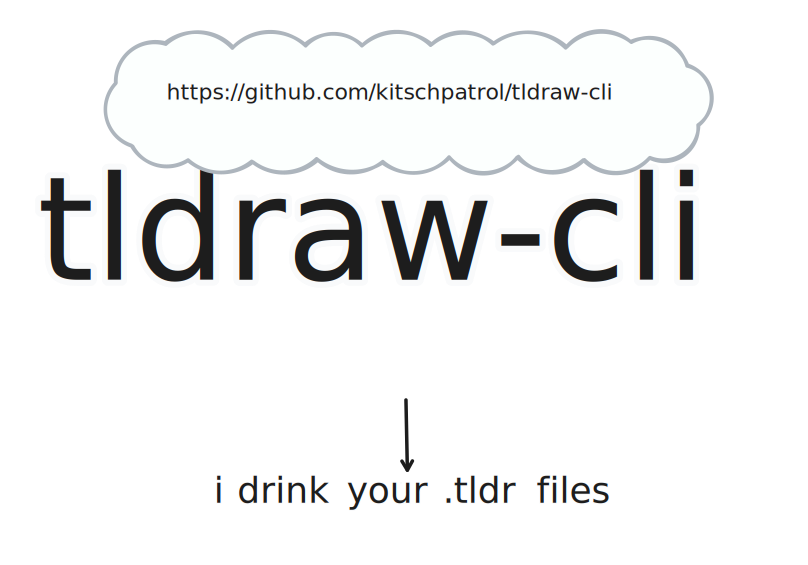

<!--+ Warning: Content inside HTML comment blocks was generated by mdat and may be overwritten. +-->

<!-- title -->

# @kitschpatrol/tldraw-cli

<!-- /title -->

<!-- badges -->

[](https://npmjs.com/package/@kitschpatrol/tldraw-cli)
[](https://opensource.org/licenses/MIT)

<!-- /badges -->

<!-- description -->

**A CLI tool for exporting tldraw sketch URLs and local .tldr files to a variety of image formats.**

<!-- /description -->

> [!IMPORTANT]
>
> The tldraw project and website are rapidly evolving, which regularly breaks `tldraw-cli`'s ability to work directly with sketch URLs. Working with local `.tldr` files should be relatively stable, but caveat emptor.

<!-- table-of-contents { maxDepth: 2 } -->

## Table of contents

- [Overview](#overview)
- [Installation](#installation)
- [Usage](#usage)
  - [CLI](#cli)
  - [API](#api)
  - [Common workflows](#common-workflows)
- [Background](#background)
- [Implementation notes](#implementation-notes)
- [The future](#the-future)
- [Maintainers](#maintainers)
- [Contributing](#contributing)
- [License](#license)

<!-- /table-of-contents -->

## Overview

A CLI app to automate conversion and export of [tldraw](https://tldraw.dev) URLs and `.tldr` files into SVG or PNG image formats, exposing a number of options along the way. It also provides commands for opening tldraw files in either local or remote instances of the tldraw editor website.

This could be useful in the context of a content publishing pipeline where you want to use a `.tldr` file (perhaps under version control) as the "source of truth" for assets to be embedded elsewhere, and you don't want to manage the export of that diagram manually.

_For `.tldr` file import support in Vite projects, please see [@kitschpatrol/vite-plugin-tldraw](https://github.com/kitschpatrol/vite-plugin-tldraw)._

## Installation

Invoke directly:

```sh
npx @kitschpatrol/tldraw-cli export some-file.tldr
```

...or install locally:

```sh
npm install --save-dev @kitschpatrol/tldraw-cli
```

...or install globally:

```sh
npm install --global @kitschpatrol/tldraw-cli
```

## Usage

### CLI

> [!NOTE]
> As of version 4.5.0, command line functionality is aliased to both `tldraw` and `tldraw-cli`.
>
> **The less verbose `tldraw` command is preferred.** The `tldraw-cli` alias is deprecated and will be removed in the next major version.

<!-- cli-help -->

#### Command: `tldraw`

CLI tools for tldraw.

This section lists top-level commands for `tldraw`.

Usage:

```txt
tldraw <command>
```

| Command  | Argument            | Description                                                                                                                                                                                                                                                                                                                                                                                                                                                                                                                                  |
| -------- | ------------------- | -------------------------------------------------------------------------------------------------------------------------------------------------------------------------------------------------------------------------------------------------------------------------------------------------------------------------------------------------------------------------------------------------------------------------------------------------------------------------------------------------------------------------------------------- |
| `export` | `<files-or-urls..>` | Export a local tldraw ".tldr" file or a tldraw\.com URL to an svg, png, json, or tldr file. Prints the absolute path(s) to the exported image(s) to stdout.                                                                                                                                                                                                                                                                                                                                                                                  |
| `open`   | `[files-or-urls..]` | Open a tldraw `.tldr` file or tldraw\.com URL in your default browser with either the official tldraw\.com site or a locally-hosted instance of the editor. Call `open` without an argument to open a blank sketch. Sketches opened via URL with the `--local` flag will be temporarily copied to the local system, and will not be kept in sync with tldraw\.com. This process does not exit until the browser is closed. Warning: Passing a local .tldr file without the `--local` option will upload and share the sketch on tldraw\.com. |

| Option              | Description         | Type      |
| ------------------- | ------------------- | --------- |
| `--help`<br>`-h`    | Show help           | `boolean` |
| `--version`<br>`-v` | Show version number | `boolean` |

_See the sections below for more information on each subcommand._

#### Subcommand: `tldraw export`

Export a local tldraw ".tldr" file or a tldraw\.com URL to an svg, png, json, or tldr file. Prints the absolute path(s) to the exported image(s) to stdout.

Usage:

```txt
tldraw export <files-or-urls..>
```

| Positional Argument | Description                                                                                                                                                                                                                                                                     | Type    |
| ------------------- | ------------------------------------------------------------------------------------------------------------------------------------------------------------------------------------------------------------------------------------------------------------------------------- | ------- |
| `files-or-urls`     | The tldraw sketch to export. May be one or more paths to local `.tldr` files, or tldraw\.com sketch URLs. Accepts a mix of both file paths and URLs, and supports glob matching via your shell. Prints the absolute path(s) to the exported image(s) to `stdout`. _(Required.)_ | `array` |

| Option                  | Description                                                                                                                                                                                                                                                          | Type                     | Default                                   |
| ----------------------- | -------------------------------------------------------------------------------------------------------------------------------------------------------------------------------------------------------------------------------------------------------------------- | ------------------------ | ----------------------------------------- |
| `--format`<br>`-f`      | Output image format.                                                                                                                                                                                                                                                 | `"png"` `"svg"` `"tldr"` | `"svg"`                                   |
| `--output`<br>`-o`      | Output image directory.                                                                                                                                                                                                                                              | `string`                 | `"./"`                                    |
| `--name`<br>`-n`        | Output image name (without extension).                                                                                                                                                                                                                               | `string`                 | The original file name or URL id is used. |
| `--frames`              | Export each sketch "frame" as a separate image. Pass one or more frame names or IDs to export specific frames, or pass the flag without the arguments to export all frames. By default, the entire first page is exported with all frames.                           | `array`                  | `false`                                   |
| `--pages`               | Export each sketch "page" as a separate image. Pass one or more page names or IDs to export specific page, or pass one or more page index numbers (from 0), or pass the flag without the arguments to export all pages. By default, only the first page is exported. | `array`                  | `false`                                   |
| `--transparent`<br>`-t` | Export an image with a transparent background.                                                                                                                                                                                                                       | `boolean`                | `false`                                   |
| `--dark`<br>`-d`        | Export a dark theme version of the image.                                                                                                                                                                                                                            | `boolean`                | `false`                                   |
| `--padding`             | Set a specific padding amount around the exported image.                                                                                                                                                                                                             | `number`                 | `32`                                      |
| `--scale`               | Set a sampling factor for raster image exports.                                                                                                                                                                                                                      | `number`                 | `1`                                       |
| `--strip-style`         | Remove `<style>` elements from SVG output, useful to lighten the load of embedded fonts if you intend to provide your own stylesheets. Applies to SVG output only.                                                                                                   | `boolean`                | `false`                                   |
| `--print`<br>`-p`       | Print the exported image(s) to stdout instead of saving to a file. Incompatible with `--output`, and disregards `--name`. PNGs are printed as base64-encoded strings.                                                                                                | `boolean`                | `false`                                   |
| `--verbose`             | Enable verbose logging. All verbose logs and prefixed with their log level and are printed to `stderr` for ease of redirection.                                                                                                                                      | `boolean`                | `false`                                   |
| `--help`<br>`-h`        | Show help                                                                                                                                                                                                                                                            | `boolean`                |                                           |
| `--version`<br>`-v`     | Show version number                                                                                                                                                                                                                                                  | `boolean`                |                                           |

#### Subcommand: `tldraw open`

Open a tldraw `.tldr` file or tldraw\.com URL in your default browser with either the official tldraw\.com site or a locally-hosted instance of the editor. Call `open` without an argument to open a blank sketch. Sketches opened via URL with the `--local` flag will be temporarily copied to the local system, and will not be kept in sync with tldraw\.com. This process does not exit until the browser is closed. Warning: Passing a local .tldr file without the `--local` option will upload and share the sketch on tldraw\.com.

Usage:

```txt
tldraw open [files-or-urls..]
```

| Positional Argument | Description                                                                                                                                                                                | Type    |
| ------------------- | ------------------------------------------------------------------------------------------------------------------------------------------------------------------------------------------ | ------- |
| `files-or-urls`     | The `.tldr` file(s) or tldraw\.com sketch URL(s) to open. Omit the argument to open a blank sketch. Supports glob matching via your shell. Prints the URL of the local server to `stdout`. | `array` |

| Option              | Description                                                                                                                     | Type      | Default |
| ------------------- | ------------------------------------------------------------------------------------------------------------------------------- | --------- | ------- |
| `--local`<br>`-l`   | Open the file or URL in a local instance of tldraw, instead of tldraw\.com.                                                     | `boolean` | `false` |
| `--verbose`         | Enable verbose logging. All verbose logs and prefixed with their log level and are printed to `stderr` for ease of redirection. | `boolean` | `false` |
| `--help`<br>`-h`    | Show help                                                                                                                       | `boolean` |         |
| `--version`<br>`-v` | Show version number                                                                                                             | `boolean` |         |

<!-- /cli-help -->

#### Examples

##### Basic `.tldr` file image export

To export the file `your-drawing.tldr` to an SVG named `your-drawing.svg` in the current working directory, run the following command. Note that the default output format is SVG, and the default export location is the current working directory.

```sh
tldraw export your-drawing.tldr
```

The file will retain its original name, e.g. `your-drawing.svg`

##### Basic tldraw\.com image download

```sh
tldraw export https://www.tldraw.com/s/v2_c_JsxJk8dag6QsrqExukis4
```

The tldraw\.com URL's id (e.g. `v2_c_JsxJk8dag6QsrqExukis4`) will be used for the file name.

This is approximately equivalent to clicking the tldraw\.com "☰ → Edit → Export As → SVG" menu item.

##### Export a remote tldraw\.com image to a local .tldr file

```sh
tldraw export https://www.tldraw.com/s/v2_c_JsxJk8dag6QsrqExukis4 --format tldr
```

This is approximately equivalent to clicking the tldraw\.com "☰ → File → Save a copy" menu item.

Note that using `--format tldr` with a _file path_ instead of a _URL_ will still send the file through the pipeline, but it's effectively a no-op. (Except perhaps in rare edge cases where tldraw performs a file format version migration).

##### Export to a specific image / file format

```sh
tldraw export your-drawing.tldr --format png
```

This is approximately equivalent to clicking the tldraw\.com "☰ → Edit → Export As → PNG" menu item.

##### Export with a transparent background

```sh
tldraw export your-drawing.tldr --transparent --format png
```

This is approximately equivalent to checking the tldraw\.com "☰ → Edit → Export As → ☐ Transparent" menu item.

##### Export to a specific destination

```sh
tldraw export your-drawing.tldr --output ~/Desktop
```

Exports to `~/Desktop/your-drawing.svg`

##### Export to a specific destination and filename

```sh
tldraw export your-drawing.tldr --output ~/Desktop --name not-your-drawing
```

Exports to `~/Desktop/not-your-drawing.svg`

##### Export all frames from a tldraw\.com URL

```sh
tldraw export https://www.tldraw.com/s/v2_c_FI5RYWbdpAtjsy4OIKrKw --frames
```

The exported files will be suffixed with their frame name, e.g.:

`v2_c_FI5RYWbdpAtjsy4OIKrKw-frame-1.png`
`v2_c_FI5RYWbdpAtjsy4OIKrKw-frame-2.png`
`v2_c_FI5RYWbdpAtjsy4OIKrKw-frame-3.png`

The frame name will be slugified.

It's possible in tldraw to give multiple frames in a single sketch the same name. In these cases, the frame ID is used in addition to the name to ensure unique output file names.

##### Export a specific frame from a tldraw\.com URL

```sh
tldraw export https://www.tldraw.com/s/v2_c_FI5RYWbdpAtjsy4OIKrKw --frames "Frame 3"
```

##### Export multiple frames from a tldraw\.com URL

```sh
tldraw export https://www.tldraw.com/s/v2_c_FI5RYWbdpAtjsy4OIKrKw --frames "Frame 1" "Frame 3"
```

##### Export a specific page by name from a tldraw\.com URL

```sh
tldraw export https://www.tldraw.com/s/v2_c_L_RFQ3mJA_BWHejdH2hlD --pages "Page 3"
```

##### Export a specific pages by index from a tldraw\.com URL

```sh
tldraw export https://www.tldraw.com/s/v2_c_L_RFQ3mJA_BWHejdH2hlD --pages 0 2
```

##### Export each pages as its own SVG from a tldraw\.com URL

```sh
tldraw export https://www.tldraw.com/s/v2_c_L_RFQ3mJA_BWHejdH2hlD --pages
```

##### Export to JSON

```sh
tldraw export https://www.tldraw.com/s/v2_c_FI5RYWbdpAtjsy4OIKrKw --format "json"
```

The `.tldr` file format is also JSON under the covers, but the `--format json` flag will yield a slightly different format than `--format tldr`. `--format json` is equivalent to what's produced via the tldraw\.com "☰ → Edit → Export As → JSON" menu item.

I'm not completely clear on the use-case for this format, but since tldr.com supports it, so too shall `tldraw-cli`.

##### Write an SVG to stdout

```sh
tldraw export https://www.tldraw.com/s/v2_c_FI5RYWbdpAtjsy4OIKrKw --print
```

##### Open a tldraw\.com URL

```sh
tldraw open https://www.tldraw.com/s/v2_c_FI5RYWbdpAtjsy4OIKrKw
```

The remote sketch is copied to a locally-hosted instance of tldraw, which is then opened in your default browser.

### API

The `tldraw-cli` command line functionality is also provided in module form for programmatic use in TypeScript or JavaScript Node projects.

The library exports two async function, `tldrawToImage`, and `tldrawOpen`.

#### `tldrawToImage`

This mirrors the `tldraw export` CLI command.

It takes an options argument mirroring the arguments available via the command line. The same default values apply:

```ts
 async function tldrawToImage(
  tldrPathOrUrl: string,
  {
    dark?: boolean
    format?: 'svg' | 'png' | 'json' | 'tldr'
    frames?: boolean | string[]
    name?: string
    output?: string
    padding?: number
    pages?: boolean | string[] | number[]
    print?: boolean
    scale?: number
    stripStyle?: boolean
    transparent?: boolean
 }): Promise<string[]>;
```

The function exports the image in the requested format and returns an array of the output image(s) or file(s).

Generally, a single file is returned — but the `string[]` return type also accommodates invocations with `frame: true` where multiple images will be generated.

Assuming you've installed `@kitschpatrol/tldraw-cli` locally in your project, it may be used as follows:

```ts
// tldraw-cli-api-test.ts

import { tldrawToImage } from '@kitschpatrol/tldraw-cli'

// Convert a local file to PNG
const [imagePath] = await tldrawToImage('./some-file.tldr', { format: 'png', output: './' })
console.log(`Wrote image to: "${imagePath}"`)

// Convert a remote tldraw.com URL to SVG
await tldrawToImage('https://www.tldraw.com/s/v2_c_JsxJk8dag6QsrqExukis4')

// Convert all frames from a single tldraw.com URL to separate SVGs
// When the `frames` option is set, the function returns an array
// of resulting file paths, instead of a solitary string
const framePathsArray = await tldrawToImage('https://www.tldraw.com/s/v2_c_FI5RYWbdpAtjsy4OIKrKw', {
  frames: true,
})
console.log(`Wrote frames to: "${framePathsArray}"`)

// Convert a specific frame from a tldraw.com URL to a PNG
await tldrawToImage('https://www.tldraw.com/s/v2_c_FI5RYWbdpAtjsy4OIKrKw', {
  frames: ['Frame 3'],
  format: 'png',
})

// You can also use the frame id instead of the frame name, if you're into that sort of thing
// It will work with or without the `shape:` prefix
await tldrawToImage('https://www.tldraw.com/s/v2_c_FI5RYWbdpAtjsy4OIKrKw', {
  frames: ['shape:x8z3Qf7Hgw4Qqp2AC-eet'],
})
```

By default, the Node API only logs warnings and errors. If you want to log the equivalent of the `--verbose` flag from the command line version, then you can set a flag on a logging object exported from the library:

```ts
// tldraw-cli-api-verbose-test.ts

import { tldrawToImage, log } from '@kitschpatrol/tldraw-cli'

// this will log extra info
log.verbose = true
await tldrawToImage('https://www.tldraw.com/s/v2_c_JsxJk8dag6QsrqExukis4')

// now we'll only log errors and warnings
log.verbose = false
await tldrawToImage('https://www.tldraw.com/s/v2_c_JsxJk8dag6QsrqExukis4')
```

#### `tldrawOpen`

Mirrors the `tldraw open` CLI command.

> [!CAUTION]
> Passing a local .tldr file with the `location: 'remote'` option will upload and share your sketch on tldraw\.com.

```tsx
async function tldrawOpen(
  tldrPathOrUrl?: string,
  options?: Partial<{
    location: 'local' | 'remote'
  }>,
): Promise<{
  browserExitPromise: Promise<ChildProcess>
  openedSketchUrl: string
}>
```

It's important to note that the returned result includes `browserExitPromise`, which resolves when the user has completely exited the web browser used to open the tldr file or url.

You _must_ await the `browserExitPromise` (or somehow keep script's process alive) if you're opening a tldr file with the \`location: 'local'\`. This prevents the local server from closing prematurely, which would interfere with any server-dependent actions in tldraw.

Example of opening a local file:

```ts
import { tldrawOpen } from 'tldraw-cli'

const { browserExitPromise } = await tldrawOpen('./sketch.tldr', {
  location: 'local',
})

// Wait for the browser to close to keep
// the local tldraw instance running!
await browserExitPromise
```

While opening the file remotely on tldraw\.com is more casual:

```ts
import { tldrawOpen } from 'tldraw-cli'

await tldrawOpen('./sketch.tldr', {
  location: 'remote',
})
```

#### `tldrawToShareUrl`

```ts
async function tldrawToShareUrl(tldrPathOrUrl: string): Promise<string>
```

Returns a live "share" url for a given local or remote tldraw sketch URL.

> [!CAUTION]
> Passing a local .tldr file to this function will upload and share your local file to tldraw\.com.

### Common workflows

If you're working with .tldr files and `tldraw-cli` locally, it's often convenient to automatically export image files from your sketches whenever they've changed.

Depending on your workspace and particularly use-cases, there are several approaches that can work well to trigger re-export on change:

#### A pure CLI workflow

The [`chokidar-cli`](https://www.npmjs.com/package/chokidar-cli) tool (which wraps the [Chokidar](https://github.com/paulmillr/chokidar) library) makes quick work of this:

```sh
npx chokidar-cli "**/*.tldr" -c "npx @kitschpatrol/tldraw-cli export ${path}"
```

This will watch for changes to .tldr files anywhere in or below the current directory, and then export an SVG every time they change. Pass [additional flags](#subcommand-tldraw-export) to `tldraw-cli export` if you need particular export settings.

#### VS Code tldraw extension workflow

The [tldraw extension for VS Code](https://marketplace.visualstudio.com/items?itemName=tldraw-org.tldraw-vscode) allows you to edit local .tldr files directly from a tab in your editor. This combines well with the [File Watcher](https://marketplace.visualstudio.com/items?itemName=appulate.filewatcher) extension to trigger re-exports after making edits in a tldraw tab:

Install the extensions (assuming you have `code` in your path):

```sh
code --install-extension tldraw-org.tldraw-vscode
code --install-extension appulate.filewatcher
```

Then configure your workspace's `.vscode/settings.json` file to include the following:

```json
{
  "filewatcher.commands": [
    {
      "match": "\\.tldr",
      "isAsync": true,
      "cmd": "cd ${workspaceRoot} && npx @kitschpatrol/tldraw-cli export ${file}",
      "event": "onFileChange"
    }
  ]
}
```

#### Vite / static-site workflow

If you're using one of the many [Vite](https://vitejs.dev/)-powered web frameworks out there, the [`@kitschpatrol/vite-plugin-tldraw`](https://github.com/kitschpatrol/vite-plugin-tldraw) plugin can help you treat .tldr as regular importable / linkable assets in your site by automating conversion to a web-friendly format during both development and production builds of your site.

See the [plugin's readme](https://github.com/kitschpatrol/vite-plugin-tldraw/blob/main/readme.md) for details, but the gist is that it lets you import and use .tldr files as if they were already SVGs:

```ts
import tldrFile from './test-sketch.tldr'

document.body.innerHTML = ``
```

Will render:

```html

```

## Background

The potential utility of a tldraw CLI app has received mention a few times.

On GitHub:

- [\[Feature\]: CLI export application #1491](https://github.com/tldraw/tldraw/issues/1491)
- [AWS Lambda-based approach](https://gist.github.com/steveruizok/c30fc99b9b3d95a14c82c59bdcc69201)
- [Added exporting of shapes and pages as images](https://github.com/tldraw/tldraw/pull/468)
- [\[feature\] Copy/Share as PNG](https://github.com/tldraw/tldraw-v1/issues/361)

On Discord:

- [@jorisjh in #ideas_old](https://discord.com/channels/859816885297741824/859816885801713730/1156880056501665802)
- [@Nitsuj in #ideas_old](https://discord.com/channels/859816885297741824/859816885801713730/1020352607920869406)

## Implementation notes

This tool is not a part of the official tldraw project.

Due to the architecture of tldraw, export depends on functionality provided by a web browser. So, behind the scenes, this app serves a local instance of tldraw, then loads a `.tldr` and invokes the export download via the [Puppeteer](https://pptr.dev) headless browser automation tool.

This can be a bit slow, (exporting seems to take a second or two), but in the context of a statically-generated content pipeline it's not the end of the world.

In terms of Puppeteer vs. Playwright and other headless browser automation tools, it [looks like](https://www.checklyhq.com/blog/puppeteer-vs-selenium-vs-playwright-speed-comparison/) Puppeteer's performance likely compares favorably. (Though I have not tested and benchmarked the alternatives in the specific context of `tldraw-cli`.)

The local instance of tldraw includes its assets dependencies, so the tool should work correctly without internet access.

Track the [tldraw changelog](https://github.com/tldraw/tldraw/blob/main/CHANGELOG.md).

## The future

Eventually, I think it would make sense for some kind of CLI tool like this one to be part of the core tldraw project. (Similar to how [tldraw-vscode](https://github.com/tldraw/tldraw/tree/main/apps/vscode) is currently integrated.)

I'm consciously releasing this tool under the `@kitschpatrol` namespace on NPM to leave the `tldraw-cli` package name available to the core tldraw project.

## Maintainers

[@kitschpatrol](https://github.com/kitschpatrol)

<!-- footer -->

## Contributing

[Issues](https://github.com/kitschpatrol/tldraw-cli/issues) and pull requests are welcome.

## License

[MIT](license.txt) © Eric Mika

<!-- /footer -->
